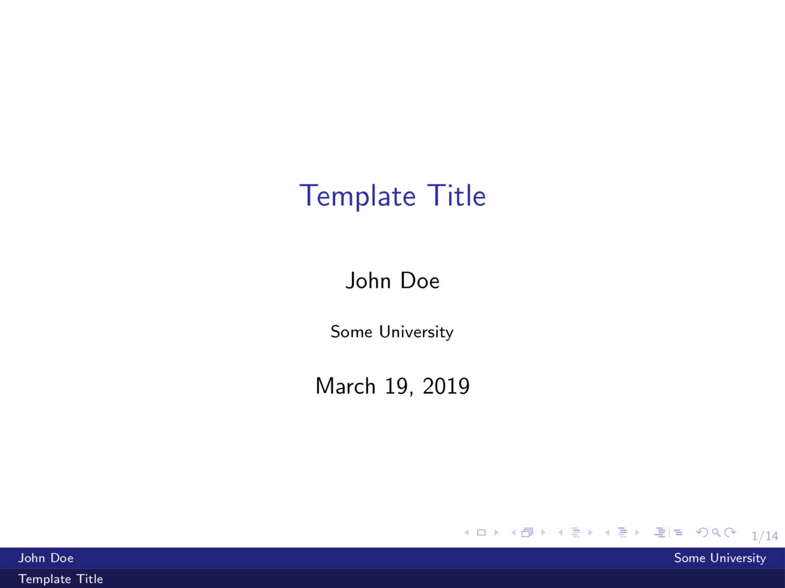

# Latex Beamer Template
_Latex Beamer Template_ as used for most of my presentations

Feel free to change and modify. Change requests are welcome too.

## Functionality
* [x] Simple design
* [x] Navigation bar
* [x] Standard examples
* [x] Table of Contents
* [x] References
* [x] Appendix
* [x] Makefile
* [x] Video embedding
* [x] Pseudocode embedding
* [x] Customizable footer

## Useful
* [Link to pseudocode commands](https://en.wikibooks.org/wiki/LaTeX/Algorithms#Typesetting_using_the_algorithmic_package)
